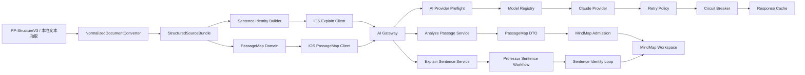

# AI 核心链路重做设计

日期：2026-04-20  
适用分支：`codex/ai-core-rebuild`  
状态：已确认方向，待进入实现计划

## 1. 背景

本轮不是继续在旧结构树和旧 prompt 上打补丁，而是重写以下核心链路：

1. 语句解析系统
2. AI 请求网关
3. 思维导图解析工作台
4. 锚点一致性与主导图准入

当前审计结论：

- iOS 活跃路径仍然是旧结构树链路换皮：`SourceDetailView -> SourceOutlineTab -> TeachingTreeCanvasView -> StructureTreePreviewView`
- `AppViewModel` 主路径仍保留 `legacyRemote / legacyLocal / fallbackLegacy / buildingTree / buildingPreview`
- 后端仍是 `DashScope/OpenAI 兼容 client + GeminiRetryClient` 的过渡混合态，没有真正的 Provider 架构
- 单句深讲和全文分析的 contract 仍旧新混杂，前后端边界不清
- `NodeProvenance`、`AnchorConsistencyValidator`、hygiene 体系已存在，但还没有成为思维导图主导图唯一准入闸门
- 本地 AI 环境变量当前缺失
- 服务器 `47.94.227.58` 当前 SSH key/权限不可用，部署验证存在前置阻塞
- 仓库中存在明文 key 泄露风险，必须在实现中清理

## 2. 设计目标

### 2.1 目标

- 用 Provider 架构重做 Node AI 网关
- 用严格 contract 重做 `explain-sentence`
- 把 `analyze-passage` 瘦身为地图级分析
- 让 iOS 请求层形成 request identity 闭环
- 让 503、timeout、配置缺失全部走结构化错误、缓存、降级和本地骨架
- 让思维导图工作台以 `PassageMap domain` 为核心，而不是继续依赖旧结构树语义
- 用 `NodeProvenance + MindMap admission` 保证标题、summary、锚句来自同一来源

### 2.2 非目标

- 不继续优化旧 `StructureTreePreview*` 的视觉细节
- 不继续扩展旧 `parse-source` 远程回退路径
- 不在本轮实现新的多 provider UI 选择界面
- 不在客户端写入任何 API key、服务器密码、token

## 3. 强约束

### 3.1 安全约束

- 不允许把 API key、服务器密码、token 写入源代码、README、日志、prompt、GitHub
- 所有密钥只允许走环境变量
- 本地缺少环境变量时，不继续真实模型请求
- 服务器部署必须优先使用现有 SSH key 或本机已配置的 SSH
- 无法 SSH 时，不得伪造部署成功

### 3.2 实现约束

- 保留 `PP-StructureV3 -> NormalizedDocumentConverter -> StructuredSourceBundle` 这条有效的文本清洗主链
- 旧 `legacyRemote / legacyLocal / fallbackLegacy / StructureTreePreview` 必须退出主实现路径
- `analyze-passage` 和 `explain-sentence` 职责必须硬分界
- 503 必须具备重试、熔断、缓存、降级
- 单句结果不允许污染别的句子
- 主导图节点必须通过一致性准入

### 3.3 当前前置阻塞

- 本地环境变量缺失：`NOVAI_API_KEY`、`AI_PROVIDER`、`AI_MODEL`、`AI_BASE_URL`、`AI_API_KIND`、`AI_TIMEOUT_MS`、`AI_MAX_RETRIES`、`AI_CIRCUIT_BREAKER_ENABLED`
- 服务器 `root@47.94.227.58` 当前无法通过现有 SSH 配置登录

这两个阻塞项必须在实施计划中显式列出，并在部署验证阶段单独检查。

## 4. 总体架构



架构原则：

- 文本清洗、AI 网关、地图域模型、客户端 UI 四层解耦
- `PassageMap domain` 只负责文章地图，不负责句子深讲
- `Professor Sentence Workflow` 只负责单句教授式解析，不负责全文地图
- 思维导图只吃通过 admission 的节点，不直接拼原始 AI 输出

## 5. PassageMap Domain

`PassageMap domain` 是全文理解工作台的新核心域模型。它取代“结构树先行”的思路，负责表达“文章主题 -> 段落主旨 -> 教学重点/核心句/易错点/题目证据”的地图层级。

### 5.1 核心实体

- `PassageMap`
  - `documentID`
  - `articleTheme`
  - `authorCoreQuestion`
  - `progressionPath`
  - `paragraphMaps`
  - `keySentenceIDs`
  - `questionLinks`
- `ParagraphMap`
  - `segmentID`
  - `paragraphIndex`
  - `theme`
  - `argumentRole`
  - `coreSentenceID`
  - `relationToPrevious`
  - `examValue`
  - `teachingFocuses`
  - `studentBlindSpot`
- `MindMapNode`
  - `id`
  - `kind`
  - `title`
  - `summary`
  - `children`
  - `provenance`
  - `admission`

### 5.2 设计要求

- `PassageMap` 只承载地图级信息，不承载句子级 grammar focus、忠实翻译、教学解读
- `ParagraphMap` 必须可独立映射为思维导图第一层
- `PassageMap` 既是 UI 数据源，也是 admission 之前的中间层
- `PassageMap` 允许保留辅助层候选节点，但主导图只消费 admission 通过结果

## 6. NodeProvenance

`NodeProvenance` 是节点可追溯性的强制数据结构，必须成为所有主导图节点的必备字段。

### 6.1 必备字段

- `sourceSegmentID`
- `sourceSentenceID`
- `sourceKind`
- `hygieneScore`
- `consistencyScore`
- `generatedFrom`

### 6.2 语义要求

- `sourceSegmentID` 表示节点主要归属的段落
- `sourceSentenceID` 表示节点锚定的句子；无明确锚句的节点也必须说明为空的原因
- `sourceKind` 用于区分正文主线、题目证据、词汇辅助、污染内容等
- `hygieneScore` 由文本清洗链路产出，描述源内容是否适合进入主线
- `consistencyScore` 由 admission 计算，描述标题/summary/锚句是否匹配
- `generatedFrom` 说明节点来自本地骨架、段落卡、AI 句子分析、题目链接等哪一类生成源

## 7. MindMap Admission

`MindMap admission` 是主导图节点的唯一准入闸门。任何节点如果没有通过 admission，都不能直接进入主导图。

### 7.1 准入规则

1. `title` 和所属 source paragraph overlap 足够
2. `summary` 和所属 source paragraph overlap 足够
3. `anchorSentence` 必须属于 `sourceSegmentID`
4. 单句解析的 `originalSentence` 与真实 sentence text 必须高重叠
5. `paragraphCard.coreSentenceID` 必须属于当前段
6. `question evidence` 只能进入辅助层
7. `vocabulary support` 只能进入词汇辅助层
8. `sourceKind` 非正文主线时，不得直接进入主导图主层

### 7.2 准入结果

- `mainline`：允许进入主导图
- `auxiliary`：进入辅助层，不进主导图主层
- `rejected`：直接拒绝

### 7.3 节点长度限制

- root summary `<= 60` 字
- paragraph summary `<= 50` 字
- focus summary `<= 40` 字
- sentence summary `<= 36` 字

## 8. AI Provider Preflight

在任何模型调用之前，后端必须执行 `AI provider preflight`。这是新的网关入口守卫。

### 8.1 preflight 检查项

- 必要环境变量是否存在
- `AI_PROVIDER` 是否已注册
- `AI_API_KIND` 是否被该 provider 支持
- `AI_MODEL` 是否在 provider 支持列表内
- timeout/retry/circuit breaker 配置是否合法
- payload 是否超出路由允许大小

### 8.2 preflight 失败行为

- 不继续请求上游
- 直接返回结构化错误
- `error_code` 必须为 `MODEL_CONFIG_MISSING`、`PAYLOAD_TOO_LARGE` 或其他可识别错误
- `fallback_available` 必须按路由能力返回

## 9. AI 网关设计

### 9.1 新模块

后端新增或重构为以下模块：

- `backend/src/models/modelRegistry.js`
- `backend/src/models/providers/claudeProvider.js`
- `backend/src/models/aiClient.js`
- `backend/src/models/retryPolicy.js`
- `backend/src/models/circuitBreaker.js`
- `backend/src/models/responseCache.js`
- `backend/src/models/errors.js`

### 9.2 网关职责

- 统一 provider 注册与模型能力描述
- 统一 request metadata
- 统一错误分类
- 统一重试/熔断/缓存
- 统一日志追踪

### 9.3 标准 request metadata

所有网关请求必须记录：

- `request_id`
- `route_name`
- `provider`
- `model`
- `payload_hash`
- `timeout_ms`
- `retry_count`

### 9.4 Claude provider

首个 provider 为 `claude`，但它需要支持你要求的 anthropic-messages 风格 API 调用：

- `baseUrl` 可配置
- `apiKey` 只来自环境变量
- `api` 固定支持 `anthropic-messages`
- `model` 可配置
- `maxTokens` 可配置

Provider 层需要屏蔽上层 service 对具体 HTTP 格式的感知。

## 10. Structured 503 Error

503 与 timeout 必须返回统一结构，不能再依赖零散字符串拼接。

标准错误结构：

```json
{
  "success": false,
  "error_code": "UPSTREAM_503",
  "message": "AI 服务暂时繁忙，已展示本地解析骨架",
  "request_id": "srv-...",
  "retryable": true,
  "fallback_available": true
}
```

### 10.1 错误分类

- `MODEL_CONFIG_MISSING`
- `UPSTREAM_401`
- `UPSTREAM_403`
- `UPSTREAM_429`
- `UPSTREAM_500`
- `UPSTREAM_502`
- `UPSTREAM_503`
- `UPSTREAM_504`
- `UPSTREAM_TIMEOUT`
- `INVALID_MODEL_RESPONSE`
- `PAYLOAD_TOO_LARGE`

### 10.2 治理顺序

1. retry
2. circuit breaker
3. response cache
4. local fallback skeleton

### 10.3 重试策略

- 429 / 500 / 502 / 503 / 504 可重试
- 最多 3 次
- exponential backoff
- jitter
- 每次重试都记录同一个 `request_id`

### 10.4 熔断策略

- 连续 3 次 `503` 或 timeout 后 open
- 30 秒内直接短路返回 fallback 错误
- 30 秒后进入 half-open 探测

### 10.5 缓存策略

- `sentence explanation` 按 `sentenceID + textHash`
- `passage analysis` 按 `documentID + contentHash`
- 503 时优先读缓存
- 无缓存时返回本地骨架 fallback

## 11. explain-sentence 设计

### 11.1 contract

`explain-sentence` 必须以教授式英语句法解析为唯一职责，返回严格结构：

- `identity`
- `original_sentence`
- `sentence_function`
- `core_skeleton`
- `faithful_translation`
- `teaching_interpretation`
- `chunk_layers`
- `grammar_focus`
- `misreading_traps`
- `exam_paraphrase_routes`
- `simpler_rewrite`
- `simpler_rewrite_translation`
- `mini_check`

禁止继续把旧兼容字段当主契约。

### 11.2 explain-sentence identity loop

`explain-sentence identity loop` 是这一轮必须落地的强闭环：

1. iOS 选中句子时构建 identity：
   - `client_request_id`
   - `documentID`
   - `sentenceID`
   - `segmentID`
   - `sentenceTextHash`
   - `anchorLabel`
2. 后端接收后把 identity 原样纳入请求上下文
3. service 产出结果时必须回填 identity
4. iOS 响应落地前再次校验：
   - `sentenceID`
   - `segmentID`
   - `sentenceTextHash`
   - `anchorLabel`
5. 任一不一致：
   - 丢弃结果
   - 打日志
   - 不污染当前句子

这个 identity loop 用来彻底解决“返回结果串句子”“A 句的结果落到 B 句”问题。

### 11.3 Professor Sentence Workflow

`Professor Sentence Workflow` 是单句深讲的统一流程：

1. 用户在原文或导图中选中一句
2. iOS 先生成本地骨架和 identity
3. iOS 发送 `explain-sentence`
4. 网关执行 provider preflight
5. provider 调用上游模型
6. 后端把模型响应压成严格教授式 contract
7. iOS 做 identity 校验
8. 通过则替换本地骨架
9. 失败则保留本地骨架，并展示“重新获取 AI 精讲”

### 11.4 教授式讲解要求

单句输出必须体现以下教学阶段：

1. 破除误读
2. 句法手术
3. 边界测试
4. 阅读题映射

语言要求：

- 中文主导
- 不允许大段英文解释中文区
- `faithful_translation` 和 `teaching_interpretation` 严格区分
- 不允许再输出 `[subject: ...]` 这种 bracket 字符串

## 12. analyze-passage 设计

### 12.1 职责边界

`analyze-passage / explain-sentence boundary` 必须硬切开：

- `analyze-passage` 只做全文地图
- `explain-sentence` 只做单句深讲

`analyze-passage` 不得再返回句子级：

- `grammar_focus`
- `faithful_translation`
- `teaching_interpretation`
- `core_skeleton`

### 12.2 contract

`analyze-passage` 只返回：

- `passage_overview`
- `paragraph_cards`
- `key_sentence_ids`
- `question_links`

### 12.3 设计要求

- 最多 4 段
- 每段最多 700 字符
- key sentences 最多 6
- `paragraph_cards` 必须能直接映射为 `PassageMap`
- 它的作用是告诉导图“文章是怎么推进的”，而不是替代句子细讲

## 13. iOS 客户端设计

### 13.1 请求层

重点涉及：

- `AIExplainSentenceService.swift`
- `ProfessorAnalysisService.swift`
- `AppViewModel.swift`
- `ArchivistWorkspaceViewModel.swift`

### 13.2 客户端职责

- 为单句请求构建 identity
- 为全文请求构建文档级 request metadata
- 统一解析结构化错误
- 统一处理 cache / fallback / retry log
- 统一把 passage map 和 sentence workflow 接到 UI

### 13.3 fallback

单句 fallback 必须提供：

- 原句
- 粗主干
- 忠实翻译暂不可用提示文本
- 教学解读暂不可用提示文本
- 基础语块切分
- 基础易错点
- “重新获取 AI 精讲”按钮

全文 fallback 必须提供：

- 原文段落列表
- 段落角色基础推断
- 本地思维导图骨架

### 13.4 debug 日志

iOS 日志必须覆盖：

- `request_id`
- `provider`
- `model`
- `error_code`
- `retry_count`
- `used_cache`
- `used_fallback`

## 14. 思维导图工作台设计

新的主导航就是“思维导图”，不再是旧结构树。

### 14.1 主层级

- 中心节点：文章主题
- 第一层：段落主题
- 第二层：教学重点 / 核心句 / 易错点 / 题目证据

### 14.2 辅助层

以下内容默认只能进入辅助层：

- 题目
- 答案
- 词汇
- 纯中文说明

### 14.3 交互要求

- `fitToContent`
- `focusCurrentNode`
- pinch zoom
- drag pan
- minimap
- compact / detailed
- 大材料 lazy rendering / virtualization

### 14.4 UI 结构要求

- UI 主数据源来自 `PassageMap domain`
- admission 后的节点进入主导图
- 不允许继续直接消费旧 `OutlineNode` 生成逻辑作为主工作台核心

## 15. 旧路径退场策略

以下内容不再允许作为新主链路继续扩展：

- `legacyRemote`
- `legacyLocal`
- `fallbackLegacy`
- `StructureTreePreview*`
- 旧 “结构树” 状态命名和文案
- `DashScope`/`Gemini*` 命名的 AI 网关模块

保留但降级为迁移辅助的内容：

- `NormalizedDocumentConverter`
- hygiene / provenance 基础字段
- 本地缓存存储思路

## 16. 部署与验证设计

### 16.1 服务器要求

目标服务器：`47.94.227.58`

部署流程必须包含：

1. 检查服务器当前目录结构
2. 找到真实 Node 部署目录
3. 识别运行方式：`systemd / pm2 / docker / 直接 node`
4. 备份当前版本
5. 部署新版后端
6. 配置 `.env`
7. 重启服务
8. 健康检查
9. curl 验证
10. iOS 真实请求验证

### 16.2 当前阻塞

当前服务器无法通过现有 SSH 配置登录，因此部署与线上验证只能设计，不得在没有权限的情况下声称成功。

### 16.3 curl 验证要求

必须验证：

- `/health`
- `/ai/explain-sentence`
- `/ai/analyze-passage`

并验证：

- request_id 可追踪
- 503 会重试
- 503 会 fallback
- 无环境变量会直接返回结构化错误

## 17. 安全整改要求

本轮实现必须同步处理以下安全问题：

- 清理仓库中明文 key 泄露内容
- 不把用户在对话中给出的 key 写入仓库文件
- `.env` 仅保留在本地或服务器，不提交
- 部署脚本不得 `echo` API key
- 日志中不得打印完整密钥

## 18. 验收标准

最终必须满足：

1. AI 网关具备 provider、preflight、retry、circuit breaker、cache、structured error
2. 503 时用户看到本地骨架，不是空白失败
3. 每次请求都有 request_id，可从 iOS 追到后端
4. explain-sentence 不会污染别的句子
5. analyze-passage 只做地图级分析
6. 思维导图主数据来自 `PassageMap domain`
7. 主导图节点全部带 `NodeProvenance`
8. admission 决定主导图准入
9. 语法讲解中文主导
10. bracket 主干格式退出前端展示
11. `xcodebuild` 通过
12. `node --check` 通过
13. `npm test` 通过
14. curl 本地接口通过
15. 有 SSH 权限后，线上接口验证通过

## 19. 设计结论

本轮采用“干净重切，不做旧树补丁”的方案：

- 保留有效的文本清洗底座
- 重写 AI 网关
- 重写单句与全文的 contract 边界
- 重写思维导图主工作台的数据入口与准入体系
- 把旧结构树彻底从主路径降级

下一步进入实现计划时，必须围绕这份设计拆成可验证、可分批交付的任务，不允许重新退回“旧树上补 UI”或“旧 prompt 小修”的路径。
